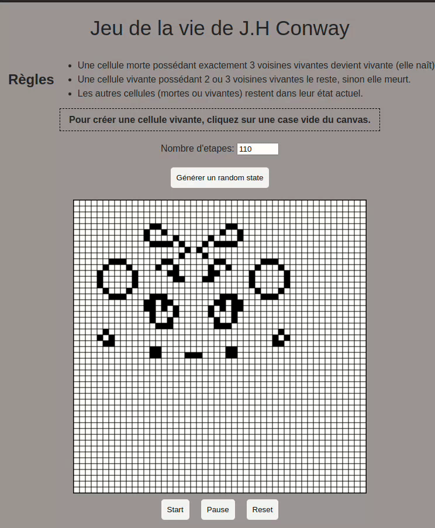

# Jeu de la vie Conway

### Description
Le jeu de la vie (ou game of life) est un automate cellulaire évoluant sur une grille (de taille théoriquement infinie)
composée de cases carrées appelées cellules qui ont un état binaire (1 pour vivante et 0 pour morte). Les cellules
évoluent dans le temps en fonction de leur voisinage (chaque cellule a 8 cellules voisines)., ce qui modifie la grille
à chaque étape d'évolution (appelée génération).


### Règles
- Une cellule morte possédant exactement 3 voisines vivantes devient vivante (elle naît).
- Une cellule vivante possédant 2 ou 3 voisines vivantes le reste, sinon elle meurt.
- Les autres cellules (mortes ou vivantes) restent dans leur état actuel.

### Implémentation
- Le jeu de la vie est implémenté en python sous forme de package: `galsen_game_of_life`
- Le package est publie sur PyPi: https://pypi.org/project/galsen-game-of-life/

### Utilisation
Vu qu'on a mis notre solution sous forme de package donc pour l'utiliser indépendemment du test qu'on propose dans ce projet vous devez creer un projet python et installer le package.

Donc on commence par installer le package:

```bash
pip3 install galsen-game-of-life
```
Pour tester notre implementation du jeu de la vie on a plusieurs options:

#### 1. application client/serveur

Pour notre part on a mis en place un [websocket](https://fr.wikipedia.org/wiki/Websocket) client/serveur.


Pour lancer le serveur websocket, il faut lancer le script `main_server.py` dans le dossier `api/`:

```bash
python3 api/main_server.py
```

Le serveur websocket est alors accessible sur `ws://localhost:8000`

Ensuite on a mis en place un client javascript pour pouvoir communiquer avec le serveur websocket.
Il suffit juste d'ouvrir le fichier `index.html` (dans le dossier `client-app/`) dans un navigateur web pour pouvoir jouer au jeu de la vie.

<b>Spoiler Alert:</b> On est pas trop bon en html/css par ici!! 



#### 2. application console
Une autre option c'est de tester sur des fichiers en console.

On peut jouer au jeu de la vie en ligne de commande!. Pour cela il vous faudra un fichier de depart contenant un etat initial
Exemple de fichier de depart:
```bash title="test-data.txt"
0 1 1 1 1 0 1 1 0 1
0 0 0 0 0 0 0 0 0 1
1 0 0 0 1 1 0 0 1 0
0 1 1 0 1 1 0 1 0 1
0 0 0 0 0 1 1 1 0 0
0 0 0 1 0 0 1 0 1 0
1 0 1 1 1 0 0 1 0 1
1 1 0 0 0 0 0 0 1 1
1 0 1 0 1 1 0 1 1 1
1 0 0 0 0 0 1 0 0 0
```
Pour lancer le jeu de la vie en ligne de commande, il faut ensuite installer le package `galsen-game-of-life`:

```bash
pip3 install galsen-game-of-life
```

ensuite on peut lancer en ligne de commande:
```bash
galsen-game-of-life --input test-data.txt --num-steps 10 --output-file test-data-out.txt
```

> `--num-steps` : pour le nombre d'iterations
> `--input` : le path du fichier en entrée
> `--output-file` : le fichier en sortie (optionnel)

Si on veut voir les etapes intermediaires, on peut ajouter l'option `--verbose`:
```bash
galsen-game-of-life --input test-data.txt --num-steps 10 --output-file test-data-out.txt --verbose 1
```
